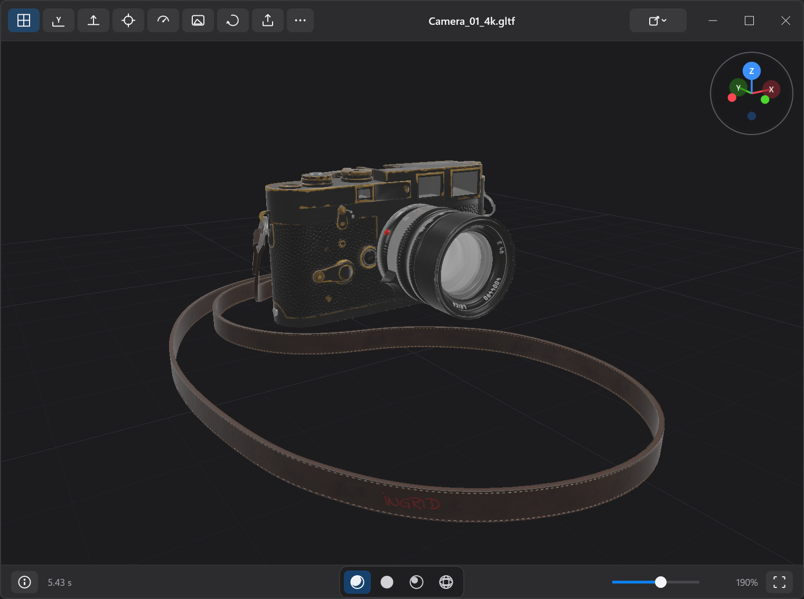

# Preview 3D

**A fast, secure, and native 3D object viewer for Windows**

[](https://github.com/binbuf/preview-3d/releases/latest) [](LICENSE) [](#install) [](#supported-formats)

[Download the latest release](https://github.com/binbuf/preview-3d/releases/latest) · [Report an issue](https://github.com/binbuf/preview-3d/issues) · [Contributing](CONTRIBUTING.md) · [Windows security help](.docs/WINDOWS-SECURITY.md)

<!-- Screenshots: add the images under docs/screenshots/ (see docs/screenshots/README.md), then uncomment this block.
<p align="center">
  
  
</p>
-->

## Highlights

- Open **glTF/GLB, OBJ, FBX, STL, PLY, 3MF, USD/USDZ, and STEP/STP** files locally.
- Navigate with familiar Blender-style orbit, pan, and frame controls, plus Unreal-style right-mouse fly, a navigation gizmo, and a keyboard-friendly command set.
- Inspect models with Studio, Clay, and rotatable Directional lighting, Wireframe mode, an information panel, and point-cloud rendering.
- Drag and drop a file, press **Ctrl+O**, pass a path on the command line, or use Windows **Open with** integration.
- Parse and decode in a zero-capability AppContainer worker: models stay local, are never modified, and nothing is uploaded.
- Install with the setup program, or use the portable ZIP with no installer.

## Supported formats

| Format | Support |
| --- | --- |
| glTF 2.0 | `.glb` and `.gltf`, including local relative binary and image sidecars, Draco/meshopt geometry, KTX2/Basis and PNG/JPEG/WebP textures |
| Wavefront OBJ | `.obj` with optional local `.mtl` and texture sidecars |
| FBX | Binary or ASCII `.fbx`, including static hierarchy, instances, supported materials/textures, and a deterministic baked start pose |
| STL | ASCII and binary |
| PLY | ASCII and binary triangle meshes and point clouds |
| 3MF | The supported static `.3mf` preview subset: Core geometry/components/build items, Materials and Properties colors/textures, Production model parts, and bounded Beam Lattice previews |
| Universal Scene Description | `.usd`, `.usda`, `.usdc`, and `.usdz`: static meshes, hierarchy/instances, common primvars, display color, bounded USD Preview Surface materials/textures, and bounded local composition |
| STEP | `.step` and `.stp`: self-contained ISO 10303-21 AP203/AP214/AP242 B-rep or authored AP242 tessellated geometry, assemblies, instance/shape/face colors, and authored length units |

For the exact supported subset, resource ceilings, and known limitations of each format, see [Format support and limits](.docs/FORMAT-SUPPORT.md).

## Install

1. Download the installer or portable ZIP from [Releases](https://github.com/binbuf/preview-3d/releases/latest).
2. Run the installer, or extract the portable ZIP and keep `worker`, `OpenUsdHost`, and `StepHost` beside `Preview3D.exe`.
3. Open a model by dragging a supported file onto the window, pressing `Ctrl+O`, or running `Preview3D.exe <path-to-model>`.

The installer adds Preview 3D to **Open with** and **Default apps** for the supported extensions. Windows keeps existing default-app choices; confirm any changes in Default apps after installation.

> [!IMPORTANT]
> Releases are currently **unsigned** while code-signing and reputation work is in progress, so Windows may block the app or one of the DLLs bundled beside it (for example the Bad Image status `0xC0E90002`). Only download from this repository's Releases page and verify the supplied SHA-256 checksum. For the portable ZIP, right-click the downloaded file, choose **Properties**, and select **Unblock** *before* extracting, so its contents do not inherit the mark. Smart App Control has no per-file exception; see [Windows security help](.docs/WINDOWS-SECURITY.md) for the specific, safe steps to allow a release you have verified.

## Build from source

### Prerequisites

- Windows 11 x64.
- Visual Studio with the **Desktop development with C++** workload (the `v145` MSVC toolset, C++20) and a Windows 10/11 SDK. The `.slnx` solution format needs a recent Visual Studio release.
- [vcpkg](https://learn.microsoft.com/vcpkg/get_started/get-started). Visual Studio ships one at `<Visual Studio>\VC\vcpkg`; a standalone clone works too.
- NSIS 3, only for the installer target.

### Set up on a new workstation

The pinned dependency versions live in `vcpkg.json` and `vcpkg-configuration.json`, but the compiled dependencies are **not** committed — `vcpkg_installed/` is gitignored. A fresh clone therefore has to restore them once, and MSBuild only does that when vcpkg integration is installed for your user. Using the vcpkg you intend to build with (the Visual Studio-bundled copy lives at `<Visual Studio>\VC\vcpkg`):

```powershell
vcpkg integrate install
```

Then open `Preview3D.slnx`, pick **Release | x64** (or **Debug | x64**), and build. The first build runs `vcpkg install` against the root manifest and populates `vcpkg_installed\x64-windows-static-md`. Release builds statically link the dependency closure (`VcpkgUseStatic`/`VcpkgUseMD` in `Directory.Build.props`) so the shipped payload contains no upstream DLLs — only the app's own images. The OpenUSD overlay port (`packaging/vcpkg-ports/openusd`) and the STEP host's separate OCCT manifest (`compatibility-host-step\vcpkg.json`, installed under `compatibility-host-step\vcpkg_installed`) compile from source, so this first restore takes **tens of minutes to a few hours**; later builds reuse the archives under `%LOCALAPPDATA%\vcpkg\archives`.

If the build cannot find a third-party header instead of restoring, the integration is not active for the MSBuild you are running:

```
error C1083: Cannot open include file: 'pxr/base/plug/plugin.h'
error C1083: Cannot open include file: 'fastgltf/core.hpp'
```

Re-run `vcpkg integrate install` with the vcpkg you build with, then rebuild. (With a standalone vcpkg, make sure `VCPKG_ROOT` points at it and that no other vcpkg is integrated.)

### Command line

```powershell
msbuild Preview3D.slnx /p:Configuration=Release /p:Platform=x64
msbuild Preview3D.slnx /t:CreatePortableRelease /p:Configuration=Release /p:Platform=x64
msbuild Preview3D.slnx /t:CreateInstaller /p:Configuration=Release /p:Platform=x64
```

The first command builds the viewer, worker, and both compatibility hosts. The second writes the portable archive and checksum to `artifacts\portable`; the third requires NSIS 3 and writes the installer to `artifacts\installer`. See the [portable package notes](packaging/portable/PORTABLE-README.txt) and [installer notes](packaging/installer/INSTALLER-README.txt) for release and cleanup details.

Tests, fixture lanes, and fuzz targets are described in [CONTRIBUTING.md](CONTRIBUTING.md).

## Documentation

- [Format support and limits](.docs/FORMAT-SUPPORT.md)
- [Windows download and protection guidance](.docs/WINDOWS-SECURITY.md)
- [Installer verification](.docs/INSTALLER_VERIFICATION.md)
- [Release workflow](.github/workflows/release.yml)
- [Contributing guidelines](CONTRIBUTING.md)
- [Security policy](SECURITY.md)

## Credits

Interface icons: [Magnific](https://www.flaticon.com/free-icons/geometric), [Iconir](https://www.flaticon.com/free-icons/perspective), [Magnific](https://www.flaticon.com/free-icons/grid), and [Magnific](https://www.flaticon.com/free-icons/speed) via Flaticon.

## License

Copyright 2026 Binbuf. Preview3D is licensed under the [Apache License 2.0](LICENSE).
See [NOTICE](NOTICE) for required attribution notices and
[third-party license information](THIRD-PARTY-LICENSES.md) for dependencies.
